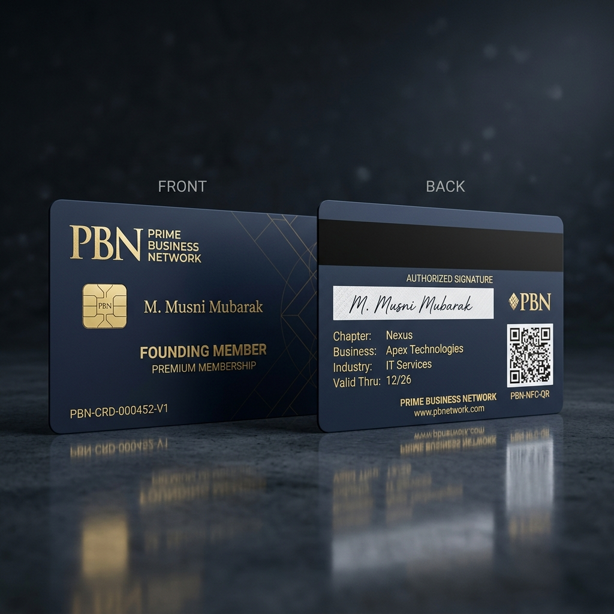
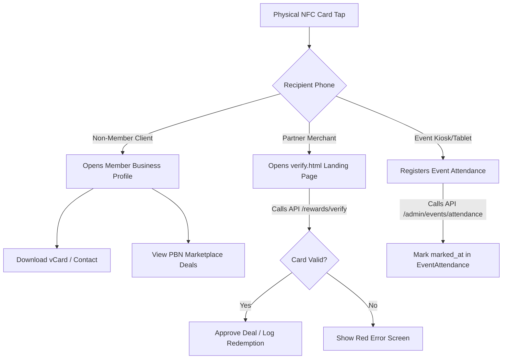

# Prime Business Network (PBN) – NFC Membership Card Design & Integration Plan

To make the PBN NFC Membership Card an indispensable business tool rather than a showcase card, we must combine **premium physical aesthetics** with **frictionless digital workflows** that integrate directly with the current codebase.

This analysis and plan proposes a card design that leverages the existing backend schemas (`PrivilegeCard`, `User`, `EventAttendance`, `OfferRedemption`) and frontend landing pages (`verify.html`).

---

## 1. Visual Presentation & Mockup

Here is the design mockup representing the front and back of the premium **PBN NFC Privilege Card**. It utilizes a matte navy base, gold accents, a physical smart-chip mockup, and structured metadata slots.



---

## 2. Card Anatomy: Front & Back

### Front Side (Visual Identity & Identity Verification)
*   **PBN Branding (Top-Left)**: The official gold "Prime Business Network" wordmark to instantly convey authority and network membership.
*   **Gold Contact Smart Chip (Left)**: While the actual communication is contactless (NFC), a visual contact chip provides a premium "executive credit card" feel. In professional networks, physical prestige matters.
*   **Member Name (Middle-Left)**: The member’s full name printed clearly (e.g., `M. Musni Mubarak`).
*   **Tier Badge (Bottom-Right)**: A high-contrast gold/silver badge denoting their verification level (e.g., `FOUNDING MEMBER`, `GOLD MEMBER`, or `PLATINUM MEMBER`). This links directly to the `verification_level` and `membership_type` fields in the database.
*   **Card Number & Version (Bottom-Left)**: A unique, monospace identifier (e.g., `PBN-CRD-000452-V1`). It corresponds directly to `card_number` and `card_version` in the `privilege_cards` table.

### Back Side (B2B Networking & Verification Utility)
*   **Magnetic Strip (Top)**: Black horizontal stripe representing the PBN Privilege Card program theme.
*   **Authorized Signature Panel (Center)**: A writeable white strip for the member’s signature. This is a critical security element that elevates the card to an official credentials document. Partner merchants can cross-reference this signature for high-value offer redemptions.
*   **Corporate Information Grid (Left)**:
    *   **CHAPTER**: The member’s local chapter (e.g., `Nexus`, `Global`).
    *   **BUSINESS**: The member’s business entity (e.g., `Apex Technologies`).
    *   **INDUSTRY**: The industry category they represent (e.g., `IT Services`). In PBN, industry seats are exclusive; displaying this on the card establishes the member's professional focus instantly.
    *   **VALID THRU**: The card expiration date (corresponds to `expires_at` in the database).
*   **Secure QR Code (Right)**: Contains the encoded URL for web-based manual scans. This acts as a fail-safe for older phones or devices without active NFC readers.
*   **Instructional Footer (Bottom)**: Tap instructions and the core network domain (`www.pbnetwork.com` or `primebusiness.network`).

---

## 3. Digital Architecture & Hardware Specifications

To achieve smooth cross-platform compatibility without requiring users to download a third-party app to read the card, we must program the NFC chips using standard **NDEF (NFC Data Exchange Format)** URL records.

### A. Hardware Selection
*   **Chip Type**: NTAG213 or NTAG215 (NTAG215 is highly recommended for compatibility and offers 504 bytes of writable memory, ample for encrypted URLs).
*   **Frequency**: 13.56 MHz (High Frequency).
*   **Protocol**: ISO/IEC 14443-A.
*   **Material Options**: 
    *   *Executive Matte Black/Navy Metal* (with laser-etched gold lettering).
    *   *Recycled Matte PVC* (0.8mm CR80 credit card size) for standard tiers.

### B. Payload Structure
The NFC chip will be programmed with a secure, unique URL pointing to the PBN verification web page:
```text
https://primebusiness.network/verify.html?uid={nfc_uid}
```
*   `{nfc_uid}`: The physical chip's unique serial number registered in the database (`nfc_uid` in the `privilege_cards` table).
*   When tapped on any NFC-enabled smartphone (iOS or Android), the device’s operating system will parse the NDEF URL and automatically open the PBN verification page in Safari or Chrome. **No app installation is required for the recipient.**

---

## 4. Key Workflows: Making the Card Useful

Here is how we use the visual, NFC, and QR components of the card to drive the PBN networking ecosystem:



### Workflow 1: The Modern "Smart" Business Card (vCard & Portfolio Sharing)
*   **Scenario**: A PBN member meets a prospective client or partner at a conference. Instead of handing over a paper business card that will get lost, they tap their NFC card on the client's phone.
*   **Integration**:
    1.  The phone opens the dynamic profile link: `https://primebusiness.network/m/{card_number}`.
    2.  The landing page displays the member's verified business details, logo, description, and list of marketplace offers.
    3.  A prominent **"Add to Contacts"** button allows the client to download a pre-populated `.vcf` vCard file. The contact card automatically includes the member’s name, phone, email, and their official PBN portfolio URL.

### Workflow 2: Rapid Event Check-In & Attendance Tracking
*   **Scenario**: Checking in hundreds of members at a weekly chapter breakfast or annual flagship meetup creates bottlenecks at the reception desk.
*   **Integration**:
    1.  The reception desk runs the PBN Admin Panel or PBN Mobile App on a tablet.
    2.  As members arrive, they tap their physical card on the tablet.
    3.  The app extracts the `nfc_uid` and sends a request to the backend:
        `POST /api/v1/admin/events/{event_id}/attendance` with the `nfc_uid`.
    4.  The backend verifies the card is active, links the card's `user_id` to the event, and records the entry in the `EventAttendance` table (inserting `marked_at` and `marked_by`).
    5.  The screen flashes a green checkmark saying "Welcome, [Name]! Check-in Complete," reducing registration queues to under 2 seconds per member.

### Workflow 3: Privilege Verification & Discount Redemption at Partners
*   **Scenario**: A member visits a partner merchant (e.g., a hotel, restaurant, or business consultant) to redeem an exclusive discount.
*   **Integration**:
    1.  The merchant asks for the PBN Privilege Card.
    2.  The member taps their card against the merchant's phone/tablet (or the merchant scans the QR code on the back).
    3.  The browser opens `verify.html?uid={nfc_uid}`.
    4.  `verify.html` calls the public backend endpoint:
        `GET /api/v1/rewards/verify/{nfc_uid}`
    5.  The page displays a premium confirmation screen:
        *   **Green Checkmark**: "✓ Card is Active"
        *   **Member Details**: Full Name, Company, Chapter, and Verification Tier (Silver, Gold, Platinum).
    6.  The merchant is assured of membership validity. The merchant then completes the transaction. If the merchant is logged into the PBN app, they scan the QR code to invoke `/api/v1/rewards/partner/scan` which registers an `OfferRedemption` in the database, updating the partner's performance dashboard.

### Workflow 4: Chapter Meeting "matchmaking" & B2B Referrals
*   **Scenario**: During a chapter meeting, Member A wants to pass a referral to Member B.
*   **Integration**:
    1.  Member A opens the PBN mobile app and taps "Receive Referral."
    2.  Member B taps their physical card against Member A's phone.
    3.  Member A's app reads the `nfc_uid`, matches it to Member B's profile, and automatically pre-populates a new referral form with Member B's info.
    4.  Member A fills in the referral details and submits. This logs a new referral record (`referrals.py`) instantly, without manual profile searches.

---

## 5. Security & Card Lifecycle Management

A physical card is susceptible to loss or theft. To protect the network's integrity and partner resources, the system implements a strict card lifecycle managed by the backend:

1.  **Immediate Suspension**:
    *   If a card is reported lost, the administrator uses the `/admin/cards/{card_id}/suspend` endpoint.
    *   This sets `card_status = "suspended"` and `is_active = False` in the database.
    *   If the physical card is tapped afterward, the merchant's verification screen immediately flashes a red error: *"This card has been suspended. Access Denied."*
2.  **Replacement & Versioning**:
    *   When a new card is issued, the `/admin/cards/{card_id}/replace` endpoint is called.
    *   The old `nfc_uid` is detached from the member.
    *   The `card_version` increments (e.g., from `1` to `2`).
    *   A new card number (e.g., `PBN-CRD-000452-V2`) is printed and bound to the member's profile.
    *   This invalidates the old physical chip permanently while preserving the member's profile and redemption history.
